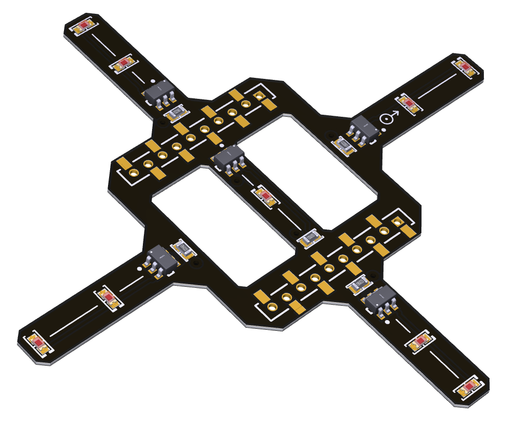

<!--
*** Template source: https://github.com/othneildrew/Best-README-Template/blob/master/README.md
-->

<!-- PROJECT SHIELDS -->
<!--
*** I'm using markdown "reference style" links for readability.
*** Reference links are enclosed in brackets [ ] instead of parentheses ( ).
*** See the bottom of this document for the declaration of the reference variables
*** for contributors-url, forks-url, etc. This is an optional, concise syntax you may use.
*** https://www.markdownguide.org/basic-syntax/#reference-style-links
-->

<!-- PROJECT LOGO -->
 

  <h3 align="center">Active motion capture marker deck</h3>

  

    Plug-in deck for the commercial-off-the-shelf drone Crazyflie. The deck uses active markers to enable tracking by a Vicon motion capture system. 
     
    <a href="https://github.com/ETH-PBL/Active-motion-capture-marker-deck"><strong>Explore the docs »</strong></a>
     
     
    <a href="https://github.com/ETH-PBL/Active-motion-capture-marker-deck/issues">Report Bug</a>
    ·
    <a href="https://github.com/ETH-PBL/Active-motion-capture-marker-deck/issues">Request Feature</a>
  

Designed by Carl Friess <carl.friess@me.com>

<!-- ABOUT THE PROJECT -->
## About The Project

Crazyflie is a nano-drone (i.e., few tens of grams) developed by Bitcraze, widely used in many research applications, such as perception, navigation, localization, etc. However, in most of these application, the performance of these perception and control algorithms needs to be precisely assesed with the aid of a motion capture system. Traditionally, these systems requires placing reflective markers on the objects to be tracked. Furthermore, the weight of the reflective markes (typically spheres with a diameter of 0.6 - 1.5mm) is not negligible, limiting the dynamic performance and the total payload of the drone. This solution replaces the traditional markers with infrared LEDs (850nm) and enables tracking at the expense of a very light payload (below 0.5g).

Note: the deck was tested in combination with a Vicon Vero 2.2 consisting of 6 cameras.

### Components
Listed below the list of key components for our integrated deck targetted for the Crazyflie 2.1 platform: 

* [BCR421UW6Q-7][https://www.mouser.ch/ProductDetail/Diodes-Incorporated/BCR421UW6Q-7?qs=7rrmt5iGdWdedcb2M%252BEvjA%3D%3D],       LED driver
* [HIR19-21C/L11/TR8][https://www.digikey.ch/de/products/detail/everlight-electronics-co-ltd/HIR19-21C-L11-TR8/2675838],       Infrared LED
* [Deck connector][https://store.bitcraze.io/collections/decks/products/female-deck-connector],       Female pin header connector 1.27mm
### PCB 
The printed circuit board (PCB) is built of 2 Layers and a thickness of 0.4mm. Further informations about the PCB can be found here:

File                                  | Content
--------------------------------------|--------
ActiveMarkerDeck.SchDoc                 | Schematics of the deck.
ActiveMarkerDeck.PcbDoc                     | Layout including 3D view.
fabrication.zip			      | Fabrication files.

The preview of the assembly, with details of logical connections can be found here:

<!-- GETTING STARTED -->

## Getting Started
When soldering the infrared LEDs, it is important to solder exactly one LED on each "arm". The pattern defined by the four LEDs should be as asymmetric as possible. If more drones are used in the same time, the patterns should be different.

## Mentions

This project was developed during the master thesis of Carl Friess, conducted under the center for Project Based Learning and the Institute of Integrated Systems in ETH.
